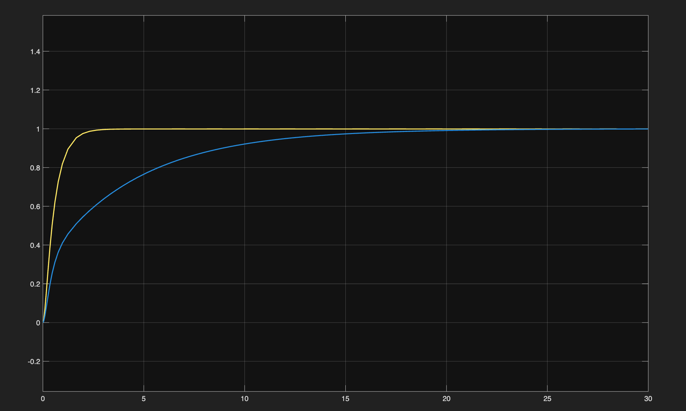
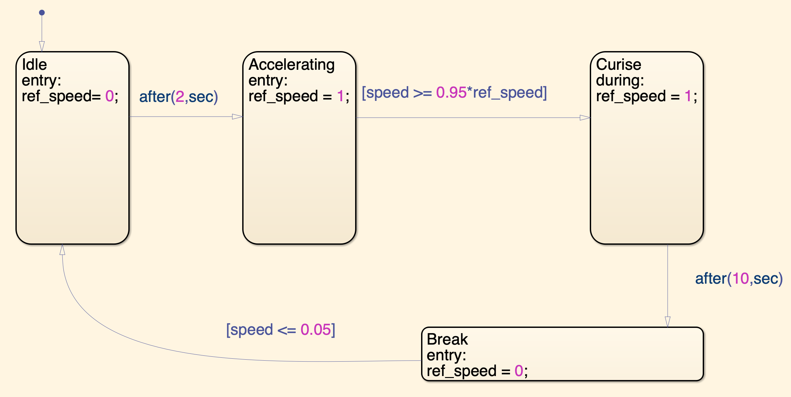
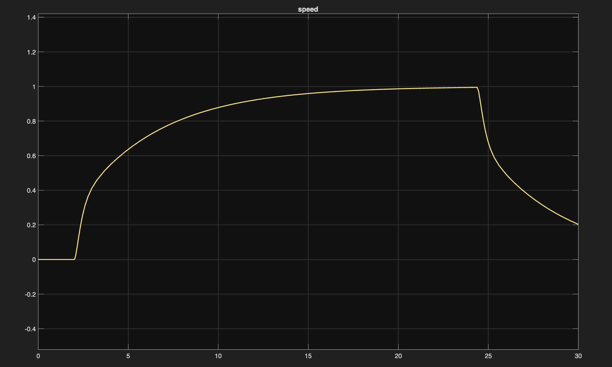

# DC-motor-control
DC motor speed control (PID-tuned)

See below for the model in Simulink:

The transfer function is given by:

$$
\frac{\Omega(s)}{V(s)} = \frac{K_t}{(L+R)(J+B)+K_e K_t}
$$

where 
J = 0.01
B = 0.1
Kt = 0.01
Ke = 0.01
R = 1
L = 0.5
in all the figures.

This figure compares the behaviour of the close loop and open loop model. We can see that the open loop model without the PID controller reaches the settling speed faster than the close loop model. However a controller is designed to achieve multiple objectives, not just "get there as fast as possible." ts also becaus in this simplify version all the parameters are known and are constant. There are also no disturbances in the system which would greatly affect the performannce of the open loop system.

A stateflow chart is added to the model to control between different states such as idle, accelerating, cruise and breaking.

