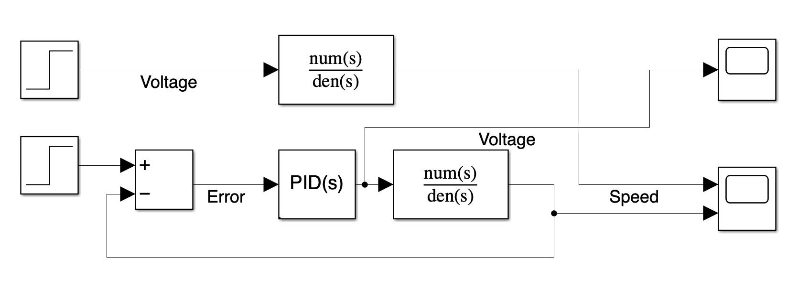

# DC-motor-control
DC motor speed control (PID-tuned)

See below for the model in Simulink:

The transfer function is given by:

$$
\frac{\Omega(s)}{V(s)} = \frac{K_t}{(L+R)(J+B)+K_e K_t}
$$

where 
J = 0.01
B = 0.1
Kt = 0.01
Ke = 0.01
R = 1
L = 0.5
in all the figures.
